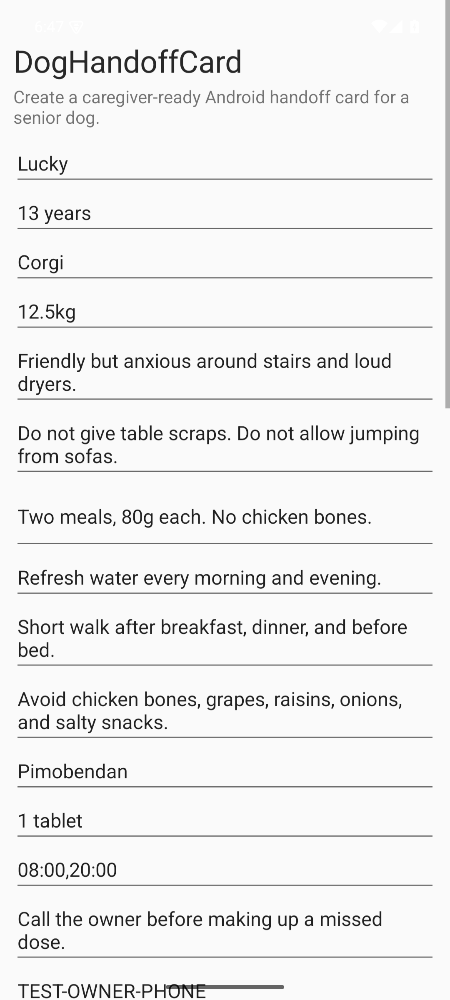

# DogHandoffCard

DogHandoffCard is a native Android app for creating senior-dog care handoff
cards before family care, boarding, or temporary pet sitting.

The project focuses on a narrow, practical workflow: enter the dog's daily
care details, check whether critical safety details are missing, save the draft
locally, and generate a plain-text card that can be shared through any Android
share target.

## Why This Exists

Temporary caregivers often receive scattered instructions through chat messages,
paper notes, or memory. Senior dogs make this risky because feeding, medication,
walk timing, and emergency contacts need to be clear before the owner leaves.

DogHandoffCard turns that handoff into a repeatable checklist and exportable
card. The current scope is intentionally small so the app stays easy to audit,
test, and extend.

## Current Features

- Native Android app written in Java with Gradle
- Single-dog handoff form for profile, temperament, feeding, water, walks,
  medication, owner contact, clinic contact, caregiver, and trip notes
- Local draft save and restore with Android `SharedPreferences`
- Handoff readiness scoring with blockers, warnings, and info items
- Share button stays disabled until critical blockers are fixed
- Plain-text handoff card builder for SMS, WeChat, email, notes, or other
  Android share targets
- Unit tests for readiness scoring, card content, and medication ordering
- GitHub Actions workflow for test and debug APK build

## Screenshot

The current Android screenshot is stored at:



## Project Structure

- `app/src/main/java/com/example/doghandoffcard/`: Android UI and domain logic
- `app/src/test/java/com/example/doghandoffcard/`: unit tests
- `.github/workflows/android.yml`: CI for unit tests and debug APK assembly
- `.github/ISSUE_TEMPLATE/`: issue templates for bug reports and feature ideas
- `docs/`: application notes, release checklist, and maintainer evidence

## Build And Run

Open this repository in Android Studio, let Gradle sync, and run the `app`
configuration on an emulator or Android phone.

The project includes Gradle wrapper files, so a fresh clone can build without a
separate Gradle installation.

```powershell
.\gradlew.bat test
.\gradlew.bat assembleDebug
```

The debug APK is generated at:

```text
app/build/outputs/apk/debug/app-debug.apk
```

## Verification Status

The maintainer verification checklist lives in
[`docs/OPENAI_OSS_APPLICATION.md`](docs/OPENAI_OSS_APPLICATION.md).

Current local gates:

- Unit tests: expected to pass with `test`
- Debug APK: expected to build with `assembleDebug`
- Device smoke test: install the debug APK, launch `DogHandoffCard`, load sample
  data, build a handoff card, and confirm the share button becomes enabled

## Roadmap

See [`ROADMAP.md`](ROADMAP.md).

## Contributing

Bug reports, focused feature ideas, and small pull requests are welcome. Please
read [`CONTRIBUTING.md`](CONTRIBUTING.md) before opening a pull request.

## License

This project is released under the MIT License. See [`LICENSE`](LICENSE).
